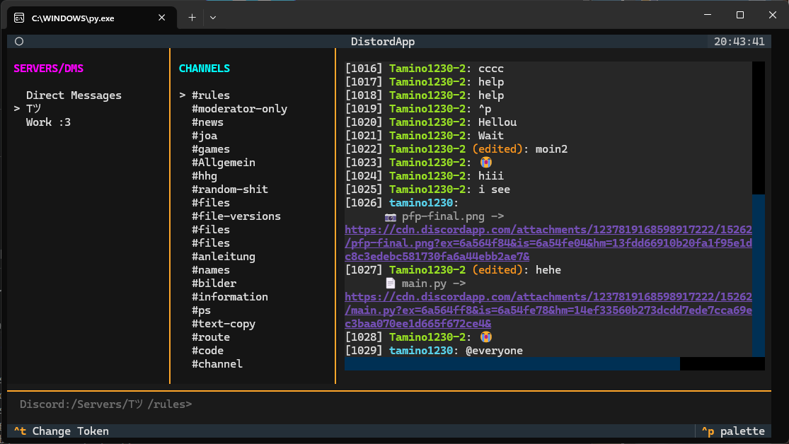
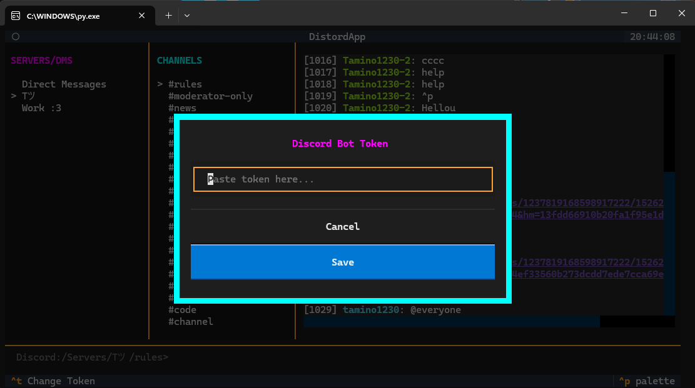

<p align="center"></p>

<h1 align="center">Distord</h1>

<p align="center">
  A python discord application to have a discord client in your terminal.
</p>

<hr>

<p align="center">
    <a target="_blank" href="https://github.com/Tamino1230/Distord/releases/latest/download/DistordInstallerWindows.exe">
        
    </a>
    <a target="_blank" href="https://github.com/Tamino1230/Distord/releases/latest/download/Distord-Linux.zip">
        
    </a>
</p>

<p align="center">
    
    
    
</p>

<p align="center">



</p>

## Creating a Bot to Login
1. Go to: [Discord Developer Portal](https://discord.com/developers/applications/)
2. Create a `New Application`
3. On the left sidebar go to: `Bot` and enable all settings at: `Privileged Gateway Intents`
4. Scroll up and press `Reset Token` and save that Token
5. On the left sidebar go to: `Installation` and Copy the Install Link
6. Scroll down and on `Guild Install` in `Scopes` add `bot`
7. Send the link in the Servers you like and Invite the Bot to see the servers.
8. Start the `Distord Client` and Paste the Token. (ctrl+t) to open the Token Modal

## Commands
**/server** <name>     - Jump to server workspace context [Use 'dms' for Direct Messages]

**/channel** <name>    - Switch channel scope context path

**/dm** <username>     - Open a direct DM channel thread with a user

**/upload** <filepath> - Upload a local file/image (Max 10MB)

**/react** <id> <emoji>- Post reaction payload directly to tracking index

**/reply** <id> <text> - Chain inline threading text reply directly to target index

**/edit** <id> <text>  - Edit a tracking message context sent by this engine client

**/delete** <id>       - Purge structural tracking record message out of history live

## Building
```sh
# clone
git clone https://github.com/Tamino1230/Distord.git
cd Distord

cd src/App
pip install -r requirements.txt
cd ../../

# windows build
cd src/Build
./buildWindows.bat

# linux
chmod +x buildLinux.sh
./buildLinux.sh
```
Then run the outputted file in the `src/Build` directory

## Common Issues:
| Issue | Solution |
| --- | --- |
| **Gateway crash**: Cannot connect to host discord.com_443 ssl:True ssl:certificate _verirfy_failed certificate very failed: unable to get local issueer certificate (_ssl.c:1010)\ | Build it on your device

If you're Issue is not listed here please open an Issue

## MIT License
[LICENSE](LICENSE)